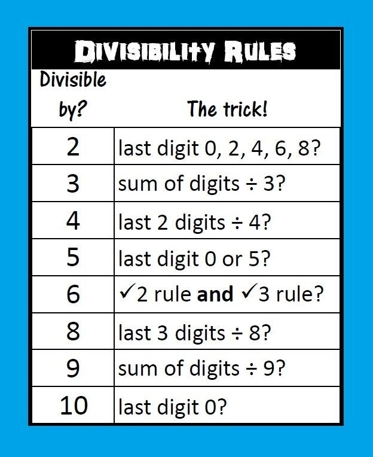

[Precalculus Youtube](https://youtube.com/playlist?list=PLDesaqWTN6ESsmwELdrzhcGiRhk5DjwLP&si=LN7ycrkZpt5d8fVw)

[Math for computer science](https://github.com/ossu/computer-science/blob/master/FAQ.md#how-can-i-review-the-math-prerequisites)

[Open Stax Algebra](https://openstax.org/details/books/elementary-algebra-2e)

## Divisibility rules

## Multiplication Tips
### By 11
$25\times11=2 +(2+5) +5 = 275$  
$31\times11=3 +(3+1) +1 = 341$
  

$253 \times 11 = 2 + (2+5)+ (5+3)+ 3 = 2783$  
$117 \times 11=1+(1+1)+(1+7)+7=1287$

### By 9
$8 \times 9= 9 \times 10 - 9= 81$  
$42 \times 9 = 42 \times 10 - 42 =420 - 42 = 378$

### Table
Probelmatic is only 6,7,8 
$6*7=42$ 
$6*8=48$ 
$7*8=56$ 

## Fractions
## Roots
## Functions
## Polynomial Functions
## Trigonometry
## Polar Coordinates
